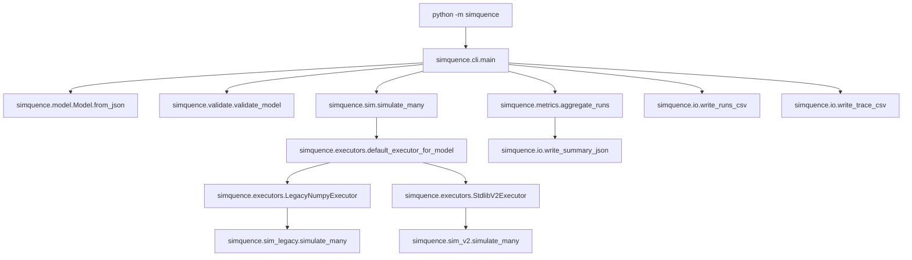
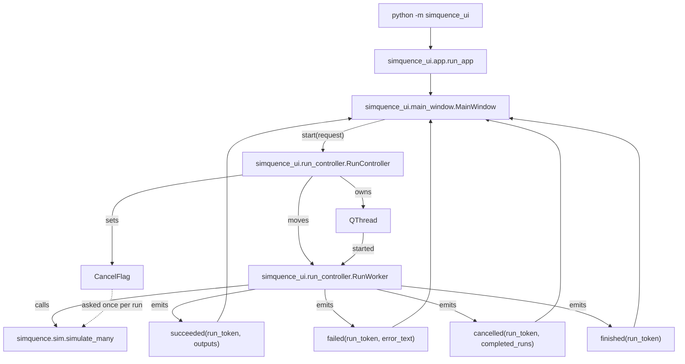
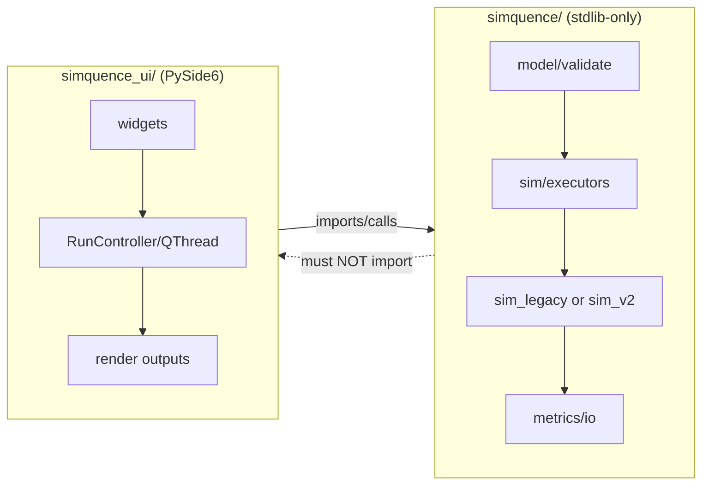

# Simquence Architecture

This document describes the *current* Simquence architecture as implemented in this repository.

Scope:

1. **Core simulator** under [`simquence/`](simquence/__init__.py:1): model parsing/validation, executor dispatch, simulation engines, metrics and file outputs.
2. **Optional GUI** under [`simquence_ui/`](simquence_ui/__init__.py:1): Qt widgets plus a threaded run controller that consumes the core APIs.
3. **Delivery** at the repository root and under [`installer/`](installer/app.py:1): the scripts that produce a Windows executable, a bespoke installer, a Flatpak and a macOS disk image.

The intent is to keep the core deterministic, stdlib-only and testable, while keeping the GUI a thin shell over the core.

## Non-negotiable invariants (enforced by tests)

1. **Core must never import Qt**.
   - Enforced by a source scan in [`tests.test_ui_dependency_boundaries.test_no_qt_imports_in_core_simquence_package()`](tests/test_ui_dependency_boundaries.py:10).
2. **Core must never depend on `simquence_ui`**.
   - Enforced by [`tests.test_ui_dependency_boundaries.test_core_does_not_reference_simquence_ui_package()`](tests/test_ui_dependency_boundaries.py:27).
3. **Simulation is deterministic for a given model plus seed**.
   - Enforced by [`tests.test_determinism.test_simulation_is_deterministic_for_seed()`](tests/test_determinism.py:11).
4. **v1 execution is a frozen behavioural oracle** (legacy compatibility path).
   - Golden output snapshot is enforced by [`tests.test_determinism.test_v1_outputs_are_stable_golden_snapshot()`](tests/test_determinism.py:32).
5. **Delayed wiring (v2) must be visible and attributable**.
   - Enforced by [`tests.test_v2_delays.test_v2_delay_creates_synthetic_delay_nodes_in_trace_and_critical_path()`](tests/test_v2_delays.py:8).
6. **A cancelled run set is never aggregated.** Stopping early raises rather than returning fewer runs, because percentiles over a truncated set are indistinguishable from real ones.
   - The refusal lives in [`simquence.cancellation.RunCancelled`](simquence/cancellation.py:29) and is covered by [`tests/test_cancellation.py`](tests/test_cancellation.py:1).
7. **Every shipped example validates.** The examples are discovered from disk rather than named, so adding one to `examples/` opts it into the check automatically.
   - Enforced by [`tests/test_validation.py`](tests/test_validation.py:70).
8. **Every version the code reports is read from the root `VERSION` file.** The core and the interface must both report the number that file holds.
   - Enforced by [`tests/test_version_single_source.py`](tests/test_version_single_source.py:1).

## High-level component map

### Core package (`simquence/`)

- **Entry points**
  - `python -m simquence` -> [`simquence.__main__`](simquence/__main__.py:1) -> [`simquence.cli.main()`](simquence/cli.py:35)
- **Model**
  - Reading a model file (duplicate keys refused) -> [`simquence.io.read_model_json()`](simquence/io.py:1)
  - JSON parsing -> [`simquence.model.Model.from_json()`](simquence/model.py:75)
  - Validation -> [`simquence.validate.validate_model()`](simquence/validate.py:10)
- **Simulation facade** (stdlib-only)
  - [`simquence.sim.simulate_many()`](simquence/sim.py:15)
- **Executor strategy boundary**
  - Protocol -> [`simquence.executors.RunExecutor`](simquence/executors.py:11)
  - Dispatch -> [`simquence.executors.default_executor_for_model()`](simquence/executors.py:73)
- **Execution engines**
  - Legacy v1 (NumPy-backed, frozen) -> [`simquence.sim_legacy.simulate_many()`](simquence/sim_legacy.py:80)
  - v2 stdlib engine (delayed wiring) -> [`simquence.sim_v2.simulate_many()`](simquence/sim_v2.py:42)
- **Cancellation** (Qt-free)
  - Protocol plus refusal -> [`simquence.cancellation`](simquence/cancellation.py:1)
- **Metrics and outputs**
  - Aggregation -> [`simquence.metrics.aggregate_runs()`](simquence/metrics.py:37)
  - Task metadata injection (v2 only) -> [`simquence.metrics.add_task_metadata()`](simquence/metrics.py:70)
  - Writers -> [`simquence.io.write_summary_json()`](simquence/io.py:11), [`simquence.io.write_runs_csv()`](simquence/io.py:16), [`simquence.io.write_trace_csv()`](simquence/io.py:47)

### GUI package (`simquence_ui/`)

- **Entry points**
  - `python -m simquence_ui` -> [`simquence_ui.__main__.main()`](simquence_ui/__main__.py:6) -> [`simquence_ui.app.run_app()`](simquence_ui/app.py:30)
  - `python runner.py` is a repo-root shim onto the same entry point and is what the frozen build starts at.
- **Main window and widgets**
  - Top-level window -> [`simquence_ui.main_window.MainWindow`](simquence_ui/main_window.py:61)
- **Threaded run lifecycle**
  - Controller -> [`simquence_ui.run_controller.RunController`](simquence_ui/run_controller.py:103)
  - Worker object -> [`simquence_ui.run_controller.RunWorker`](simquence_ui/run_controller.py:55)

#### GUI internal modules (maintainability)

The GUI code is intentionally split into smaller modules to keep individual files small and readable.

- Main window composition and behaviour:
  - Window class -> [`simquence_ui.main_window.MainWindow`](simquence_ui/main_window.py:61)
  - Panel policies (opening the composer, toggling Distributions) ->
    [`simquence_ui.main_window_dock_switching`](simquence_ui/main_window_dock_switching.py:1)
  - File IO (open model / export last outputs) ->
    [`simquence_ui.main_window_file_io.export_runs()`](simquence_ui/main_window_file_io.py:29)
  - Top bar construction and its reading order ->
    [`simquence_ui.main_window_top_bar.build_top_bar()`](simquence_ui/main_window_top_bar.py:80)
  - Each kind of top bar button and deterministic button sizing ->
    [`simquence_ui.top_bar_buttons`](simquence_ui/top_bar_buttons.py:1)
  - The donate button and the one address it hands the desktop ->
    [`simquence_ui.donate_button`](simquence_ui/donate_button.py:1) through
    the [`simquence_ui.links`](simquence_ui/links.py:1) seam
  - Menu wiring -> [`simquence_ui.main_window_menus`](simquence_ui/main_window_menus.py:1)
  - Where a file dialog opens -> [`simquence_ui.user_paths`](simquence_ui/user_paths.py:1)

- Theme and style hardening:
  - Semantic colour tokens, one set per theme -> [`simquence_ui.theme_tokens`](simquence_ui/theme_tokens.py:1)
  - Apply theme (palette plus generated stylesheet) ->
    [`simquence_ui.theme.apply_theme()`](simquence_ui/theme.py:88)
  - One stylesheet template, built from the tokens -> [`simquence_ui.theme_stylesheet`](simquence_ui/theme_stylesheet.py:1)
  - Light/dark switch -> [`simquence_ui.theme_toggle`](simquence_ui/theme_toggle.py:1)
  - QComboBox popup hardening (palette plus per-item roles, reasserted on popup show) ->
    [`simquence_ui.qt_style_helpers.harden_combobox_popup()`](simquence_ui/qt_style_helpers.py:166)
  - Table height, row heights and column widths derived from the contents ->
    [`simquence_ui.qt_style_helpers.size_table_to_rows()`](simquence_ui/qt_style_helpers.py:282)

- Keyboard navigation (one explicit focus ring, not natural Tab order):
  - Traversal controller and ring order -> [`simquence_ui.focus_cycle`](simquence_ui/focus_cycle.py:1)
  - Per-event key rules -> [`simquence_ui.focus_cycle_keys`](simquence_ui/focus_cycle_keys.py:1)
  - Menu-bar behaviour the toolkit does not provide -> [`simquence_ui.focus_cycle_menu`](simquence_ui/focus_cycle_menu.py:1)
  - Widget collection in layout order, including docks -> [`simquence_ui.focus_cycle_widgets`](simquence_ui/focus_cycle_widgets.py:1)

- Dialogs:
  - Base that opens on its first usable control, passing over reading panes -> [`simquence_ui.first_stop_dialog`](simquence_ui/first_stop_dialog.py:1)
  - A reading pane is a stop only by Tab and only while it overflows -> [`simquence_ui.pane_focus`](simquence_ui/pane_focus.py:1)
  - About and the credits it renders -> [`simquence_ui.about_dialog`](simquence_ui/about_dialog.py:1), [`simquence_ui.about_text`](simquence_ui/about_text.py:1)
  - Licence viewers -> [`simquence_ui.main_licence_dialog`](simquence_ui/main_licence_dialog.py:1), [`simquence_ui.licence_dialog`](simquence_ui/licence_dialog.py:1)
  - How to USE the application and why each setting -> [`simquence_ui.guide_dialog`](simquence_ui/guide_dialog.py:1), [`simquence_ui.guide_text`](simquence_ui/guide_text.py:1)
  - How to read the outputs -> [`simquence_ui.how_to_read_dialog`](simquence_ui/how_to_read_dialog.py:1)
  - Long text that reads itself -> [`simquence_ui.auto_scroller`](simquence_ui/auto_scroller.py:1)

- Distributions (inspection, no resimulation):
  - Dock -> [`simquence_ui.distributions_dock`](simquence_ui/distributions_dock.py:1)
  - Qt-free aggregation -> [`simquence_ui.distributions_agg`](simquence_ui/distributions_agg.py:1)
  - Critical-path frequency chart -> [`simquence_ui.critical_path_frequency_widget`](simquence_ui/critical_path_frequency_widget.py:1)

- Model Composer (authoring UI, a modal two-pane dialog):
  - Dialog and model state -> [`simquence_ui.model_composer_dialog.ModelComposerDialog`](simquence_ui/model_composer_dialog.py:60)
  - Left pane, what the model is made of -> [`simquence_ui.model_composer_tree.ComposerTree`](simquence_ui/model_composer_tree.py:46)
  - Pane assembly and dialog sizing -> [`simquence_ui.model_composer_panes`](simquence_ui/model_composer_panes.py:1)
  - Editors:
    - System -> [`simquence_ui.model_composer_system_editor.SystemEditor`](simquence_ui/model_composer_system_editor.py:9)
    - Contexts -> [`simquence_ui.model_composer_contexts_editor.ContextsEditor`](simquence_ui/model_composer_contexts_editor.py:26)
    - Tasks -> [`simquence_ui.model_composer_tasks_editor.TasksEditor`](simquence_ui/model_composer_tasks_editor.py:155)
    - Wiring -> [`simquence_ui.model_composer_wiring_editor.WiringEditor`](simquence_ui/model_composer_wiring_editor.py:30)

- Bundled-data lookup (one search, two callers):
  - The search itself -> [`simquence_ui.packaged_dir`](simquence_ui/packaged_dir.py:1)
  - Icons -> [`simquence_ui.icon_resolver`](simquence_ui/icon_resolver.py:1)
  - Example models and the labels the menu shows -> [`simquence_ui.example_models`](simquence_ui/example_models.py:1)

- Update check (GitHub releases, calm failure):
  - DTOs, version comparison, platform asset selection and the service -> [`simquence_ui.update_core`](simquence_ui/update_core.py:1)
  - GitHub releases adapter over stdlib urllib, opener injected -> [`simquence_ui.update_github`](simquence_ui/update_github.py:1)
  - Skipped-version persistence in `~/.simquence/settings.json` -> [`simquence_ui.update_settings`](simquence_ui/update_settings.py:1)
  - Prompt dialog, timers, worker thread and the install helper -> [`simquence_ui.update_check`](simquence_ui/update_check.py:1)

## Overview diagrams

### CLI call flow and executor selection

### GUI threading model (worker emits signals to UI thread)

### Dependency boundary (core is Qt-free; GUI consumes core)

## SOLID boundaries (what depends on what)

### Dependency inversion at the executor boundary

- The rest of the core calls the simulation facade [`simquence.sim.simulate_many()`](simquence/sim.py:15).
- The facade selects an execution strategy via [`simquence.executors.default_executor_for_model()`](simquence/executors.py:73).
- Executors implement [`simquence.executors.RunExecutor`](simquence/executors.py:11) and can be swapped without changing the model semantics.

This is the insertion point for future batch optimisations (including GPU or vectorised execution) without infecting the domain model.

### Dependency inversion at the cancellation boundary

The core is asked to stop through a Protocol it defines and never looks behind: [`simquence.cancellation.CancellationSignal`](simquence/cancellation.py:22) has one method, `is_cancelled()`. The GUI passes a Qt-thread-safe flag; a test passes a counter. Neither is visible to the simulator, which is what keeps the stop path out of the Qt-free boundary.

### Single responsibility

- Parsing/types in [`simquence.model.Model.from_json()`](simquence/model.py:75) do not run simulation.
- Executors in [`simquence.executors.default_executor_for_model()`](simquence/executors.py:73) only choose and delegate.
- Engines in [`simquence.sim_legacy.simulate_many()`](simquence/sim_legacy.py:80) and [`simquence.sim_v2.simulate_many()`](simquence/sim_v2.py:42) implement run semantics.
- Metrics in [`simquence.metrics.aggregate_runs()`](simquence/metrics.py:37) do not influence scheduling.

### Open/closed

- New execution strategies are added by implementing [`simquence.executors.RunExecutor`](simquence/executors.py:11) and extending selection.
- Schema evolution is intended to be additive (new optional fields with defaults) to preserve old meaning.

## Model schema (what the simulator consumes)

### Versioning

- The schema version is stored on [`simquence.model.Model.version`](simquence/model.py:63).
- JSON version keys accepted by [`simquence.model.Model.from_json()`](simquence/model.py:75):
  - `schema_version` (preferred)
  - `version` (legacy alias)
  - `model_version` (legacy alias)
- Validation currently accepts **only** versions `{1, 2}` via [`simquence.validate.validate_model()`](simquence/validate.py:10).
- Executor dispatch is future-proofed for in-memory models with `version >= 2` via [`simquence.executors.default_executor_for_model()`](simquence/executors.py:73).

### Core entities

- Contexts: [`simquence.model.ContextDef`](simquence/model.py:7)
  - `concurrency` (>= 1)
  - `policy` is currently MVP-locked to `'fifo'` (validated in [`simquence.validate.validate_model()`](simquence/validate.py:10))
- Events: [`simquence.model.EventDef`](simquence/model.py:13)
  - Optional `tags`; `"ui"` is used to compute `first_ui_event_time_ms` / `last_ui_event_time_ms`.
- Tasks: [`simquence.model.TaskDef`](simquence/model.py:54)
  - `context`, `duration_ms`, `emit` (plus optional `meta` in v2)

### Duration distributions

Durations (and delay distributions) are represented by [`simquence.model.DurationDist`](simquence/model.py:21) and validated by [`simquence.validate.validate_model()`](simquence/validate.py:10).

Supported dists:

- `fixed`: `{ "dist": "fixed", "value": <>=0 }`
- `normal`: `{ "dist": "normal", "mean": <>=0, "std": <>=0, "min": <>=0, optional, default 0 }`. Every draw below `min` is raised to `min`, so the default of 0 shifts a distribution whose spread reaches below zero.
- `lognormal`: `{ "dist": "lognormal", "mu": <=log(largest float), "sigma": <>=0 }`. Past that `mu` the median duration is infinite.

Every parameter must be a finite number. Python's JSON reader accepts the `NaN` and `Infinity` literals and NaN passes every `< 0` comparison, so the check is explicit: a NaN duration once hung the v1 engine forever, because a completion time of NaN is never equal to itself and is never popped. A single lognormal draw past the float range is infinite in both engines (NumPy returns it; the v2 engine catches the overflow and returns it too).

Names: no task or event name may contain `>`. Critical paths are identified by task names joined with `>`; event names reach that string through the synthetic `delay(event->task)` node, so a name containing it would merge two different chains into one count.

The schema version must be an integer: `2.9` used to be truncated to 2 and run.

Model files are read through one loader, [`simquence.io.read_model_json()`](simquence/io.py:1), shared by the CLI, the run worker, the window's Open and the editor. It refuses a key that appears twice in one JSON object, which plain `json.loads` resolves by keeping the last: a copy-pasted task that was not renamed (or a second `wiring` object) used to replace the first without a word. The CLI reports any unreadable or invalid model on stderr and exits with status 2 rather than a traceback.

Note: there is **no** implemented "v1 lognormal.mean" migration/conversion in this codebase. Both engines sample lognormal via `mu/sigma` (see [`simquence.sim_v2._sample_ms()`](simquence/sim_v2.py:21) and [`simquence.sim_legacy._sample_duration_ms()`](simquence/sim_legacy.py:65)).

### Wiring and delayed wiring

The input JSON uses a single `wiring` object (event -> listeners). Parsing expands that into two forms:

- v1-compatible wiring (event -> task names) stored on [`simquence.model.Model.wiring`](simquence/model.py:63)
- v2 wiring edges (event -> edges with optional delays) stored on [`simquence.model.Model.wiring_edges`](simquence/model.py:63)

Edges are represented by [`simquence.model.WiringEdge`](simquence/model.py:48).

Listener forms accepted by [`simquence.model.Model.from_json()`](simquence/model.py:75):

- `"task_name"`
- `{ "task": "task_name" }`
- `{ "task": "task_name", "delay_ms": <number | dist> }`

If `delay_ms` is a number, it is parsed as `fixed` with that value (see parsing helper inside [`simquence.model.Model.from_json()`](simquence/model.py:118)).

`delay_ms` is a version 2 feature. The v1 engine walks the flat `wiring` map, which carries no delay, so validation refuses a version 1 model that declares one rather than letting it run as though the delay were not there.

### Worked examples

`examples/` holds the models the tests validate, the documentation points at and
the application opens from its own **Examples** menu. The set is discovered from
disk in all three places rather than listed, so adding a model to that directory
opts it into the validation test and puts it on the menu, with no second place to
update:

- Validation: [`tests/test_validation.py`](tests/test_validation.py:70) walks the directory.
- Menu: [`simquence_ui.example_models.list_examples()`](simquence_ui/example_models.py:1) walks the same directory, wherever the packaging put it, deriving each label from the file name. A caption per file would read better and would be a mapping keyed on file names, which is the drift this avoids.
- Packaging: all three delivery paths stage `examples/` beside the application, so a fresh install has something to open before the user has a model of their own.

| Example | What it shows |
|---|---|
| `interactive.json` | The smallest useful v1 model: one click, one background fetch, one render. |
| `contention.json` | A context with a concurrency limit, so queue wait becomes visible. |
| `checkout.json` | A v2 storefront checkout: four parallel branches, a serialised database context and a fixed debounce delay that turns out to own the median. It is also the worked example of delayed wiring. |

## Simulation architecture

### Facade plus executor dispatch

- Public entrypoint: [`simquence.sim.simulate_many()`](simquence/sim.py:15)
- Strategy selection: [`simquence.executors.default_executor_for_model()`](simquence/executors.py:73)
  - `version == 1` -> [`simquence.executors.LegacyNumpyExecutor`](simquence/executors.py:26)
  - `version >= 2` -> [`simquence.executors.StdlibV2Executor`](simquence/executors.py:50)

### v1 legacy engine (NumPy-backed, frozen oracle)

- Implementation: [`simquence.sim_legacy`](simquence/sim_legacy.py:1)
- Policy is explicitly documented as *FROZEN* in-module (see header comments in [`simquence.sim_legacy`](simquence/sim_legacy.py:1)).
- NumPy import is lazy and errors are made explicit by [`simquence.sim_legacy._require_numpy()`](simquence/sim_legacy.py:46).

### v2 stdlib engine (delayed wiring plus synthetic delay tasks)

- Implementation: [`simquence.sim_v2`](simquence/sim_v2.py:1)
- Synthetic delays use a dedicated context constant [`simquence.sim_v2.DELAY_CONTEXT`](simquence/sim_v2.py:18) set to `"__delay__"`.

#### Delayed wiring semantics

When an event `e` occurs at time `t_emit`:

- For an edge with no delay: enqueue the target task at `t_emit`.
- For an edge with `delay_ms`: create a synthetic delay task instance named `delay(e->task)`:
  - start = `t_emit`
  - end = `t_emit + sampled_delay`
  - context = `__delay__` (not capacity constrained)
  - `parent_task_instance_id` is set to the emitting task instance id (if any)
  - on completion: enqueue the target task

This is implemented by [`simquence.sim_v2.schedule_delay()`](simquence/sim_v2.py:123) and verified by [`tests.test_v2_delays.test_v2_delay_creates_synthetic_delay_nodes_in_trace_and_critical_path()`](tests/test_v2_delays.py:8).

A delay is a first-class node precisely so it can be blamed. In `examples/checkout.json` a 150ms debounce on one branch is the critical path in most runs, which is the kind of finding the tool exists to surface.

### Cancellation semantics

Cancellation genuinely stops the work. The simulator is CPU-bound and cannot be interrupted safely from outside, so it is **asked** to stop, at the boundary between one run and the next:

- The question is a Protocol, [`simquence.cancellation.CancellationSignal`](simquence/cancellation.py:22), so the core never learns what is answering it.
- The check is once per RUN rather than once per event. Each run seeds its own generator from the run index, so stopping between runs cannot leave a run half simulated; the cost is one predicate per run rather than one per event.
- The worst-case delay before a stop takes effect is therefore one run, which is a number the user can be told.
- Stopping raises [`simquence.cancellation.RunCancelled`](simquence/cancellation.py:29) carrying the completed-run count. It does **not** return a shorter result set: aggregating half the runs would produce percentiles that look exactly like real ones while describing a system nobody asked about.
- The GUI surfaces this as [`simquence_ui.run_controller.RunController.cancelled`](simquence_ui/run_controller.py:115), which reports how many runs completed before the stop.

### Shutdown semantics

On app shutdown, the controller waits for the worker thread to finish to avoid Qt warnings (see [`simquence_ui.run_controller.RunController.shutdown()`](simquence_ui/run_controller.py:185)).

## Outputs and data contracts

### In-memory result types

- Per task-instance trace rows: [`simquence.types.TaskInstance`](simquence/types.py:6)
- Per-run results: [`simquence.types.RunResult`](simquence/types.py:22)

Important trace causality fields:

- `parent_task_instance_id`: event/delay causality ("who caused me to be enqueued")
- `capacity_parent_instance_id`: slot causality ("who last occupied the slot I ran on")

### File outputs

- `summary.json`: [`simquence.io.write_summary_json()`](simquence/io.py:11)
- `runs.csv`: [`simquence.io.write_runs_csv()`](simquence/io.py:16)
- `trace.csv` (optional): [`simquence.io.write_trace_csv()`](simquence/io.py:47)

### Metrics aggregation

- Aggregation is performed by [`simquence.metrics.aggregate_runs()`](simquence/metrics.py:37).
- Task metadata is injected into the summary **only for v2** by [`simquence.metrics.add_task_metadata()`](simquence/metrics.py:70).

#### Task metadata (measurement-only)

Tasks may include optional `meta` parsed by [`simquence.model.TaskMeta.from_json()`](simquence/model.py:34) into [`simquence.model.TaskMeta`](simquence/model.py:27) and stored on [`simquence.model.TaskDef.meta`](simquence/model.py:59).

Invariant: metadata must never affect scheduling; it is only surfaced in summary output.

## GUI architecture (how the UI consumes the core)

### Run lifecycle

- The user clicks Run in [`simquence_ui.main_window.MainWindow`](simquence_ui/main_window.py:61), which builds a [`simquence_ui.run_controller.RunRequest`](simquence_ui/run_controller.py:22) and calls [`simquence_ui.run_controller.RunController.start()`](simquence_ui/run_controller.py:142).
- The controller constructs a [`PySide6.QtCore.QThread`](simquence_ui/run_controller.py:152) and moves a [`simquence_ui.run_controller.RunWorker`](simquence_ui/run_controller.py:55) onto it, together with the cancel flag the core will be asked about.
- The worker:
  - reads JSON -> [`simquence.model.Model.from_json()`](simquence/model.py:75)
  - validates -> [`simquence.validate.validate_model()`](simquence/validate.py:10)
  - simulates -> [`simquence.sim.simulate_many()`](simquence/sim.py:15)
  - aggregates -> [`simquence.metrics.aggregate_runs()`](simquence/metrics.py:37)
  - (v2) adds metadata -> [`simquence.metrics.add_task_metadata()`](simquence/metrics.py:70)
  - emits Qt signals back to the UI thread

`succeeded` arrives BEFORE `finished`, so the controller is still running when the first is handled. Anything that depends on "the run is over" belongs on `finished`.

### Update check

The application asks `https://api.github.com/repos/oernster/Simquence/releases/latest` whether a newer published release exists: once about 3 seconds after the window shows and again every 24 hours while running, plus on demand from Help > Check for Updates. The endpoint returns only published, non-draft, non-prerelease releases, so a tag pushed mid-development can never prompt. The request is anonymous, times out after 5 seconds and any failure is silent on the automatic paths.

- The pure logic (version tuple comparison, platform asset selection by filename suffix, the check itself) lives in [`simquence_ui.update_core`](simquence_ui/update_core.py:1) behind a `ReleaseSource` Protocol; [`simquence_ui.update_github`](simquence_ui/update_github.py:1) is the urllib adapter with the opener injected so tests never touch the network.
- Threading follows the run controller's shape: the HTTP call runs on a `threading.Thread` and the result comes back through a Signal connected to a bound method of [`simquence_ui.update_check.UpdateCheckController`](simquence_ui/update_check.py:1), a QObject living on the UI thread, so delivery is a queued connection and the slot runs where widgets are safe to touch. The controller is a child of the window. If the window were deleted while a check is out, the answer would have nowhere to go and the emit would raise on the worker; a quit was measured not to do that, so this is hardening rather than a known path. The worker drops that answer when the controller is gone and re-raises any other emit failure, so no exception escapes the thread (see [`tests/test_ui_update_check.py`](tests/test_ui_update_check.py:1)).
- The prompt dialog is shown with `open()`, never `exec()`, per the repo-wide no-nested-event-loop rule. Download opens the platform-matched asset URL (falling back to the release page); Skip This Version persists the offered tag in `~/.simquence/settings.json` through [`simquence_ui.update_settings`](simquence_ui/update_settings.py:1) and that version never prompts again on the automatic paths; the manual check ignores the skip and reports every outcome.
- The composition root in [`simquence_ui.app`](simquence_ui/app.py:1) builds the service and calls `install_update_check(window, service)`; the main window contributes only a lambda for the Help menu action.

### Keyboard navigation

Full keyboard reachability is built as one explicit focus ring rather than left to natural Tab traversal.

- `Tab` and `Right` step forward, `Shift+Tab` and `Left` step back; the ring wraps at both ends. The horizontal arrows are tested first, so they step the ring everywhere rather than being swallowed by the menu bar or a list.
- Ring order is the menu titles, then the body widget stops, then the docks. Docks are siblings of `centralWidget()`, so they are collected explicitly by [`simquence_ui.focus_cycle_widgets.collect_interactive_widgets_in_layout_order()`](simquence_ui/focus_cycle_widgets.py:1). The Model Composer used to depend on that and no longer does: it is a dialog, which is a window of its own and owns its focus, so it is reached the way every other dialog is rather than by the main ring being taught to walk into it.
- A disabled or hidden control is skipped by the ring and shows no ring colour, because every hover and focus rule is gated on `:enabled`.
- **Layout order is reading order everywhere except under an overlay; a container that overlays says so itself.** The top bar centres the distributions toggle (the mark) on the WHOLE bar, which cannot be done in a row of stretches, so the mark shares one grid cell with the row of buttons and is added second (it has to be; otherwise the row takes the click where they meet). Layout order therefore reaches every button first and the mark last, so the ring crossed the bar to the theme toggle at the far right before coming back to the mark in the middle: the one control on the bar impossible to miss with the eye was the last one the keyboard offered, which a user cannot tell apart from its having been skipped. [`main_window_top_bar.NavBand`](simquence_ui/main_window_top_bar.py:1) states the bar's left-to-right order through a `ring_stops()` method that [`focus_cycle_widgets.declared_ring_stops()`](simquence_ui/focus_cycle_widgets.py:1) prefers over the layout walk. Only a container whose layout is deliberately not in reading order needs this; everything else is walked exactly as before. The order is asserted against where the controls are actually DRAWN rather than against the declared list, at a realistic window width, because a bar narrow enough for the left-hand group to run past its own centre would otherwise pin the wrong answer; a second test fails if a control on the band is missing from the declaration, so adding a button and forgetting the order cannot drop it off the ring.
- The main window starts neutral: nothing is focused and no menu is open until the first `Tab` or `Right`. Dialogs do the opposite and open already focused on their first usable control ([`simquence_ui.first_stop_dialog`](simquence_ui/first_stop_dialog.py:1)), because a dialog was opened on purpose. A reading pane is not a control, so About, the Guide, How to Read and both licences open on OK rather than on their text; list, table and tree views are kept, so the Model Composer still opens on its section tree.
- **A pane is never a stop; a reading pane is one only while it overflows.** The run output, the critical-path frequency list and every dialog's text use [`simquence_ui.pane_focus.follow_overflow()`](simquence_ui/pane_focus.py:1): `TabFocus` while there is somewhere to scroll, `NoFocus` when the text fits, re-decided whenever a scrollbar's range changes or the pane is resized. Never `StrongFocus`, because a click would then focus the whole page. The Model Composer's scrolling pages hold controls of their own, so they are `NoFocus` outright (`as_pane()`); Tab into a control on a page scrolls it into view.
- **Examples is a top-level menu rather than a submenu of File; the ring is the reason.** The ring claims Left and Right to step between stops, which is the same pair Qt uses to open and close a submenu, so a submenu would be the one part of the menu bar the keyboard could not reach the usual way. A title of its own costs nothing and is walked like any other.
- Menus are built by [`simquence_ui.main_window_menus.add_menu()`](simquence_ui/main_window_menus.py:1) with an explicit parent rather than by `menuBar().addMenu(title)`. The two look equivalent and are not: a menu built the second way is destroyed when the Python wrapper of its QAction is collected, leaving the bar holding a deleted object; the ring rebuilds exactly that wrapper list on every keystroke.

### Theme model

One stylesheet template is generated from one token set per theme ([`simquence_ui.theme_tokens`](simquence_ui/theme_tokens.py:1)), so the three-state ring model holds in every theme by construction: no ring at rest, a green ring while enabled and hovered or focused, a permanent red ring while disabled. That model is for CONTROLS. A text view (the run output, a licence, the Guide) is a pane holding words, so it keeps its resting border in every state, focus and disabled included; a structural test fails any stylesheet rule that rings a text view, an item view or a container. `accent` carries data meaning and never draws a ring.

The accent is banana yellow and is one value across both themes, like `primary`,
because a filled block does not need the per-theme adjustment a line drawn on a
surface does. Anything painted ON it takes `accent_text`, a near-black: the
accent is far too light to carry the near-white every other filled control uses.
A picture on a checked button is the exception: it keeps its own colours and
the fill alone says "on". Flattening the distributions chart to that ink was
measured and rejected; it read as a dark mound, while in full colour its
outline keeps it a chart on the yellow fill.

**One place decides how tall an input stands.** A Qt type selector matches a
class and its subclasses; `QDoubleSpinBox` is a SIBLING of `QSpinBox` rather
than a subclass, so an input rule written for the one never reached the other.
`QLineEdit` was not named at all. Measured in the composer with a model loaded,
three controls doing the same job stood at 51px, 19px and 22px. The rule now
names [`QAbstractSpinBox` and `QLineEdit`](simquence_ui/theme_stylesheet.py:140),
which reaches every kind and resets the `QLineEdit` those controls CONTAIN;
otherwise the inner field would carry the outer control's border, padding and
minimum on top of the outer's own.

The second half of that rule is that nothing may quietly overrule it. An
explicit `setMinimumHeight` on a widget is a floor a layout may squeeze down to,
so a combo the sheet sized at 48px could still be handed 26px and drawn clipped;
and the composer's scrolling body was set to `Maximum` vertically, which reads
as "no taller than it needs" and means "may be made shorter than it needs",
leaving nineteen controls under their own minimum. Both are gone.
[`tests/test_ui_input_metrics.py`](tests/test_ui_input_metrics.py:1) asserts the
invariant rather than today's numbers: no input is drawn smaller than it asks
for, in either theme. It measures the SETTLED state, since Qt defers layout and
the offscreen platform does not propagate size hints, so geometry read straight
after building a panel is whatever it was before the layout ran.

**Scrolling past a control must not change it.** Qt gives the wheel to whatever
sits under the pointer and a combo box or spin box accepts it unfocused, so
reading down the Model Composer used to walk through every concurrency and every
distribution on the way past, silently rewriting the model.
[`simquence_ui.wheel_guard`](simquence_ui/wheel_guard.py:1) denies the wheel to
an unfocused control and forwards it to the enclosing scroll area, so the panel
still scrolls rather than leaving a dead patch under the pointer. It is installed
once on the application, not per control, because the composer creates and
destroys cards as the model is edited.

Denying the wheel is not on its own enough; two further facts are what make
the rule above true rather than merely stated. Qt gives these controls
`WheelFocus` by default, which means the wheel FOCUSES them before it reaches
them, so travelling over one both took the keyboard focus and left the control
focused, which is exactly the case the guard hands its wheel back to: values
changing and focus getting stuck were one fault seen from either end.
[`deny_wheel_focus()`](simquence_ui/wheel_guard.py:81) narrows the policy on
`Polish`, which an application filter sees for controls built long after it was
installed. And the forwarded event has to skip an ancestor that cannot move: a
spin box in a table sits inside the TABLE's scroll area, so the nearest ancestor
absorbed the wheel and the panel being read never shifted.
[`enclosing_scroll_area()`](simquence_ui/wheel_guard.py:108) walks on to the
first ancestor that can consume it on the axis the wheel was turned.

**A table is as tall as what it holds and a row is as tall as what stands in
it.** Three constants that had never looked at the contents were stacked on top
of each other here. Qt's size hint for a scroll area is fixed and its minimum
allows a squeeze to roughly two rows, so the Contexts table reserved the same
height whether it held two contexts or twenty and collapsed when the panel was short. Its default column width is fixed, so a long name was clipped inside its
cell while the room it needed sat empty in the same row and nothing scrolled,
because the columns together were narrower than the viewport. And its default
row height is fixed at less than the themed inputs ask for: a spin box wanting
51px was drawn into a 30px row, so its lower half including the DOWN button fell
outside the row and was never painted; its number sat against the bottom of
what remained and read as badly aligned. That last one is one fault reported as
two, the same way the wheel and the focus were.

[`size_table_to_rows()`](simquence_ui/qt_style_helpers.py:282) fixes the height
to the rows present, capped at `MAX_VISIBLE_TABLE_ROWS` so a large model cannot
push the rest of the panel out of reach;
[`stretch_table_columns()`](simquence_ui/qt_style_helpers.py:230) gives the name
column the slack; and
[`fit_rows_to_contents()`](simquence_ui/qt_style_helpers.py:250) lets a row be
as tall as the tallest thing in it, so the control metrics decide the row rather
than the row silently cropping the control.

The height is measured with
[`_settled_row_height()`](simquence_ui/qt_style_helpers.py:265) rather than
`rowHeight()`, because a header on `ResizeToContents` recalculates lazily and the
old value is still being reported at the moment a row is filled. Measuring is
also deliberately called at the END of each mutator rather than bound to the
model's row signals: those fire while the row exists but is still empty, which
is the same class of mistake, a fact read before it is true.

One scrolling surface is the point throughout: a nested scrollbar inside a panel
that is itself scrolling is what silently absorbed the wheel meant for the outer.

**Anything that floats gets its own surface.** Menus, tooltips and combo popups are painted on `elevated`, outlined in `elevated_border` and highlight on `elevated_hover`. Without those the toolkit paints a popup in the window colour with no border, which is not a subtle contrast problem: measured in the dark theme, a dropped menu sat at zero luminance difference from the window behind it and its items read as text lying on the page. The rule is asserted against rendered pixels in [`tests/test_ui_menu_contrast.py`](tests/test_ui_menu_contrast.py:1), not against the stylesheet source.

A combo popup cannot be styled the same way, because its colours are palette-driven on purpose (a CSS background on the popup view reintroduces the invisible-text bug that [`simquence_ui.qt_style_helpers`](simquence_ui/qt_style_helpers.py:1) exists to prevent). It reads `elevated` back out of the palette instead, where it rides on the `ToolTipBase` role: Qt has no "popup background" role. The colour has to be read at the moment the popup opens rather than captured when it was built; otherwise switching theme leaves the popup painted in the old one.

### The composer names its parts rather than stacking them

The composer was a dock down the right-hand side: one column, every section in
it at once, scrolling. Measured with `examples/checkout.json` loaded, that
column asked for **4,822px** of height in a viewport of about 880, the tasks
alone accounting for 3,647 of it because each card is around 350px and there
were eleven. Everything past the second task was found by scrolling and then
remembering where it was.

A model is not a document. It is a handful of named things, so
[`ComposerTree`](simquence_ui/model_composer_tree.py:46) lists them on the left
and the right pane shows the one that is selected. The sections are fixed,
because they are the parts a model HAS rather than anything the user creates;
only Tasks has children, because tasks are the only part there can be many of
and the only part that was long. Measured the same way afterwards, every section
fits without scrolling at all: System 220px, Contexts 328, Wiring 368, one task
453, against a 753px pane.

Two details are load-bearing. The tree is relabelled rather than rebuilt when
the task COUNT is unchanged, because a name is edited a keystroke at a time and
every keystroke says the model changed: rebuilding on each one would take the
selection and the keyboard away from the field being typed into. And the task
rows come from `card_labels()` rather than `task_names()`, which drops the
unnamed: right for a model, wrong for a list someone selects from, because the
row positions would stop matching the cards the moment a task was half-typed.

It is a modal dialog rather than a dock, because composing is something you
go and do rather than keep half an eye on. That removed a policy rather than
moving one: the composer and Distributions used to share the right-hand area, so
opening either was a question about the other. Opening the composer is now
[`open_model_composer()`](simquence_ui/main_window_dock_switching.py:12), which
asks nothing about layout. It is `show()` rather than `exec()`: both are modal,
because the dialog says it is; the difference is that `exec` also starts a
nested event loop and does not return until the dialog closes, which turns
opening a panel into a call that never comes back.

The export prompt survived the change, because it was never about layout: it
asks whether to keep results that are about to stop being the thing on screen.
The compose button's checked state did not, because it existed to say which of
two panels had the right-hand area and a modal dialog IS the window while it is
open.

### Composing and editing are one surface

The composer could build a model and export it; nothing could put one back
in, so a model that had just been opened could not be edited. Editing is the
same four editors driven from the other end:
[`simquence_ui.model_composer_load.load_raw_model()`](simquence_ui/model_composer_load.py:1)
fills them from a parsed model; the order is load-bearing. Contexts go in
first because a task card can only select a context the contexts table already
knows about; the schema version goes in before the tasks because it decides
whether a card shows its category field; wiring goes last, once the task and
event names it offers are real.

Reading a model back in is wider than writing one out. The file format accepts
three spellings of the version key and three spellings of a wiring listener, so
[`model_composer_types.read_schema_version()`](simquence_ui/model_composer_types.py:1)
and `wiring_edges_from_raw()` widen every one of them: a model the engine will
run must be a model the editor will open; otherwise a valid file becomes uneditable
for a reason the user cannot see.

An open editor follows the model that is opened next
([`simquence_ui.main_window_editing.refresh_open_editor()`](simquence_ui/main_window_editing.py:1)),
because an editor showing a model is a view of it and a view that keeps
displaying the previous one is simply wrong. It follows only while it is BOTH
open and showing a loaded model: a composer holding something typed from
scratch is the user's own work; replacing that would be data loss rather
than a refresh.

Both actions appear twice, on the tray and under the Model menu, wired to the
same callable rather than to two handlers that have to be kept in step. Only
Edit changes availability, so `build_menus` returns that one action and the
window gates it from the same `availability()` call that gates every other
control.

**Guidance is two documents, not one.** The Guide says which button to press
and why you would pick one setting rather than another; How to Read says what
the output means. They are deliberately separate because they answer questions
asked at different moments and the Guide's own text is ordered on that basis:
six numbered steps with no explanation attached, then every reason afterwards,
once there is something for the reason to attach to. Its button sits
immediately left of the info button so the pair reads as one idea in two
halves and its picture is an open book, sharing no shape with the "i" in a
circle beside it.

Every action in the tray wears a supplied picture from `assets/` (named in
[`icon_resolver`](simquence_ui/icon_resolver.py:1)) rather than an emoji, which
is whatever font happens to be installed.
[`artwork_icon()`](simquence_ui/top_bar_buttons.py:1) trims each picture's
transparent margin so every action fills the same box, then derives its states:
disabled is grey and faded, because a picture that kept its colour while
disabled would read as half-available, which is not a state this application
has. A missing picture leaves the button's name as words rather than a blank.

The text lives in [`guide_text`](simquence_ui/guide_text.py:1) rather than in
the dialog, for the same reason `about_text` does: the words change far more
often than the widget; a change to the words should not be a change to a
file full of Qt. It is HTML on a `QTextBrowser` rather than plain text, which is
also what
[`auto_scroller`](simquence_ui/auto_scroller.py:1) requires: the reading cycle
moves in PIXELS; a `QPlainTextEdit` scrolls in LINES, where the same gentle
drift becomes a whole line jumping at a time.

**The distributions toggle sits dead centre** (the mark, below). The panel is
the point of having run anything, so its control takes the most prominent place
on the bar rather than being one more small button in the left-hand group.

Centring it is an overlay rather than a row of stretches: three stretches centre
a widget in the space LEFT OVER between the flanking groups; those groups
are nowhere near the same width, so it landed 134px right of centre in a 1400px
window. The controls and the mark occupy the SAME grid cell, that cell is the
whole bar and the mark centres itself in it. Measured after the change it sits
exactly on centre in both themes. The mark is added second, so it is the one
that takes a click where the two overlap.

Its height is fixed and its WIDTH is left natural. Fixing both to a size smaller
than the frame the stylesheet computes makes Qt lay the frame out at its natural
size and clip it at the widget edge, slicing the bottom border off a ring that
then stops short. A minimum width holds the centre steady if the icon set is
ever missing, because a mark that collapses moves the thing it is centring.

Checked, it keeps its picture in full colour on the accent fill; see the
accent note above for why it is not flattened to one ink.

**A panel button says whether the panel is up.** Distributions is a toggle
([`toggle_distributions()`](simquence_ui/main_window_dock_switching.py:44)), not
an opener: a control that only ever opens leaves the dock's own close cross as
the only way to undo one press. It is deliberately NOT the mirror of Compose.
Compose carries a switch-to policy because it is going somewhere, away from
results that may not have been exported; this one only says whether a panel is
showing, so it leaves the composer alone. The two are allowed up together; the composer no longer
competes for that area at all.

Its checked state is driven from the DOCK's `visibilityChanged`, never set at
the click, so the button still tells the truth when the dock is closed by its
own cross or hidden because something else took the area. The one place the
click has to intervene is a refusal: a checkable button has already flipped
itself by the time the handler runs, so declining the action has to put it back
or the button would claim a panel that never opened.

### One instance and the taskbar

The installer registers a shortcut carrying an Application User Model ID; the
application never claimed the same one, so Windows had no way to know the
shortcut and the running window were the same program. The pinned icon and the
window were two different taskbar items: clicking the pinned one did nothing
and the jump list opened a second copy beside the first.

[`simquence_ui.windows_identity`](simquence_ui/windows_identity.py:1) claims
the installer's ID before the first window exists. A test asserts the two
constants match, because two IDs would reproduce the bug in a form that is
harder to see.

[`simquence_ui.single_instance`](simquence_ui/single_instance.py:1) is a local
socket rather than a mutex, deliberately so. A bare lock would stop the
second copy and leave the user with nothing at all, which is worse than the
duplicate window: the first instance listens, a second connects, says "come
forward" and exits, so the click does what the user meant. A stale socket name
also refuses connections, which is a question that can be asked directly, where
a stale lock file has to be aged or PID-checked to tell "still running" from
"died holding it".

### Pointing at what to do next

Loading a model is the moment Run becomes the thing to press; the change
happens on the far side of the window from where the user was looking: the path
label updates on the left while the button that matters is elsewhere.
[`simquence_ui.attention_flash`](simquence_ui/attention_flash.py:1) flashes its
border twice, well spaced, then stops.

Finite on purpose. A pulse that continues until it is obeyed is a nag; the
user who has read it has no way to say so. The state machine refuses to relight
once the count is spent rather than relying on nothing firing another tick.

The colour is not chosen there: the flash sets a dynamic property and the
stylesheet paints it in the same green the ring uses for hover and focus, which
already means "you can use this". It declines to flash a disabled control, so it
can never argue with the red ring that is explaining why that control cannot be
used.

### Auto-scrolling long text

Licence and guidance text descends slowly, holds at the end, rewinds fast and repeats; it suspends the moment the reader touches it, resuming from where they left it ([`simquence_ui.auto_scroller`](simquence_ui/auto_scroller.py:1)).

The constants are PIXELS, which constrains what it may be attached to. `QTextBrowser` and `QTextEdit` scroll in pixels; `QPlainTextEdit` scrolls in LINES. Measured over the same three hundred lines, that is 4348 units of travel against 293, so the same "one unit" that reads as a drift on one becomes a whole line jumping on the other. It is attached to pixel-scrolling surfaces only.

The run output panes do not wear it: they are working output, read at the user's own pace. About wears it although it is sized at show time, from the height of its own text, so that the whole text shows without scrolling; the scroller costs nothing while nothing overflows. The installer's licence wears a standalone copy ([`installer/installer_reading_pane.py`](installer/installer_reading_pane.py:1)), since the installer runs with only `installer/` on its path and cannot import `simquence_ui`.

## Dependency management and packaging

### Runtime dependencies

- Core engine: stdlib-only by design (see import surface around [`simquence.sim.simulate_many()`](simquence/sim.py:15)).
- GUI runtime: depends on PySide6 via [`requirements.txt`](requirements.txt:1).
- Legacy v1 execution: NumPy is optional and lazily imported by [`simquence.sim_legacy._require_numpy()`](simquence/sim_legacy.py:46). It is confined to the `legacy` and `dev` extras; the failure names the extra to install.

### Packaging notes (current repository state)

- The packaged distribution is configured in [`pyproject.toml`](pyproject.toml).
- The distributable is the headless CLI core. The setuptools find rules include `simquence*`, which also globs `simquence_ui`, so the GUI package is excluded by name; the built wheel contains `simquence/` only. Asserted by [`tests/test_core_boundaries_and_packaging.py`](tests/test_core_boundaries_and_packaging.py:1) rather than described.
- A console script is exposed for the CLI only via [`pyproject.toml`](pyproject.toml).

### Delivery (desktop application)

The wheel is the library. The desktop application is delivered separately, one entry point per platform, each a linear recipe at the repository root:

| Script | Produces |
|---|---|
| `buildexe.py` | The Nuitka standalone bundle, staged into `installer/payload/`. It smoke tests the result by starting it headless and failing the build with the child's traceback if it exits. |
| `buildinstaller.py` | `dist-installer/SimquenceSetup.exe`: the payload zipped, then wrapped in the bespoke installer as a Nuitka onefile. |
| `build_flatpak.sh` / `clean_flatpak.sh` | The Linux Flatpak, manifest generated rather than committed, wheels pre-downloaded and installed offline in-sandbox. Its finish-args now grant `--share=network` so the update check can reach GitHub. |
| `builddmg.py` | The macOS disk image, with the stray `*.o` strip, codesign, notarise and staple flow. |
| `generate_icons.py` | Every platform icon asset, plus the site logo, from the single master `assets/application-icon.png`; also the donate button's mark, from its own master `donate.png`, into `assets/`. |
| `stamp_version.py` | The version tokens in the GitHub Pages site under `docs/`. |

The installer itself is an application, not a script: [`installer/`](installer/app.py:1) is a themed PySide6 GUI installer, per-user and no-admin, extracting to `%LOCALAPPDATA%`, writing the HKCU uninstall key and offering Desktop and Start Menu shortcuts. It is held to the same 400-line cap as the rest of the codebase, which is the distinction the size test encodes: the recipe that invokes Nuitka is a script, the window it produces is a program. Coverage is where it parts company with the application: [`.coveragerc`](.coveragerc) omits `installer/` along with the delivery scripts, since what they do only means anything against a real toolchain, filesystem and registry; a build proves them and the suite cannot.

Every path stages the same three things beside the application: the generated icons, the shipped `examples/` and the licence texts. The Flatpak additionally exports `SIMQUENCE_ASSETS_DIR` and `SIMQUENCE_EXAMPLES_DIR`, which are the same override hooks the tests use.

Three delivery findings are load-bearing and are recorded here so they are not rediscovered:

- **`runner.py` must not rewrite `sys.argv[0]`.** Nuitka's PySide6 plugin reads `argv[0]` when a Windows icon is compiled in, extracts icons from that file and asserts it found at least one. Pointed at a bare module name it finds no file; the frozen application dies before its first window, silently, because a release build has no console to print to.
- **A Nuitka onefile strips loose executables out of an `--include-data-dir`.** The payload therefore has to be zipped first and extracted at install time.
- **The Flatpak has to build Kerberos, for a library it never calls.** PySide6's `libQt6Network` is linked against `libgssapi_krb5.so.2`, which the freedesktop runtime does not ship. The single-instance guard imports `QtNetwork`, so on a runtime without that library the import fails at load time and the application never reaches its first window: a failure that appears only in the Flatpak and only at start-up, never in a test run on the host. `build_flatpak.sh` therefore adds a `krb5` module ahead of the Python dependencies, pinned by URL and SHA-256 and fetched by flatpak-builder on the host so the build stays as offline as the pre-downloaded wheels make it. It must be 1.22 or newer, because earlier releases still carry pre-C23 declarations the SDK's compiler rejects outright. Nothing in the application uses Kerberos; only the library has to be present for the link to resolve. The same import is why the prune script's keep list now names `QtSvg` and `QtNetwork` alongside `QtCore`, `QtGui` and `QtWidgets`: pruning what the wheels say belongs to an unused Qt module is only safe while that list is honest about what the application imports.

### Version (single source of truth)

- The only real version string in the repository is the root `VERSION` file.
- Runtime reads it through [`simquence.version.read_version()`](simquence/version.py:24), which falls back to `0.0.0-dev` when no source tree is present. `simquence_ui` re-exports the same value and the About dialog renders it.
- Packaging metadata declares the version dynamic and reads the same file.
- The GitHub Pages site under `docs/` cannot read `VERSION` at render time, so it carries `<!--VERSION-->x.y.z<!--/VERSION-->` tokens rewritten by the repo-root `stamp_version.py`. That script targets `docs/` only and is idempotent. It also puts a content hash on every local stylesheet and script link in the site (`styles.css?v=<hash>`) so a browser cannot pair a fresh page with a stale cached stylesheet.
- Enforced by [`tests/test_version_single_source.py`](tests/test_version_single_source.py:1), which asserts the core version, the UI version and the `VERSION` file agree.

### Licence split

- The core in `simquence/` (and therefore everything that is distributed) is GPL-3.0. The full text is the root `LICENSE`, which the app shows under Help > Main Licence.
- The PySide6 front end in `simquence_ui/` is LGPL-3.0. Its text is `simquence_ui/LGPL3.txt`, which the app shows under Help > UI Licence.
- `pyproject.toml` therefore declares `GPL-3.0-only` with the root `LICENSE` as its licence file, matching what the wheel actually contains.
- The bundled installer carries its own `INSTALLER_LICENSE`.

### Icon (single master)

- The mark is a stopwatch fed by a fan of coloured task lanes, on a transparent canvas.
- `assets/application-icon.png` is the single master every icon derives from, via `generate_icons.py`: the PNG size set, the multi-size Windows `.ico`, the macOS `.icns` (on an opaque rounded tile), the Flatpak hicolor set and the site's logo at `docs/assets/simquence.png`. The site is generated from the same master as the application, so the two cannot show different marks. Nothing paints an icon at runtime; the application asks [`simquence_ui.icon_resolver`](simquence_ui/icon_resolver.py:1) where the assets landed for the packaging it is running under.
- **The donate mark has a master of its own and skips the squaring.** `donate.png` at the repository root is a wide picture rather than an icon, so `generate_icons.py` crops it to its artwork and scales it by height alone, to four times the top bar's glyph height (`GLYPH_PX` in [`top_bar_buttons`](simquence_ui/top_bar_buttons.py:1)) so it stays crisp under display scaling, then writes it to `assets/donate.png` for the app. The site's `docs/donate.png` is deliberately not generated: it is the small donate mark every project site shares byte for byte, so it is copied rather than derived. That master sits at the repository root rather than in `assets/`, because every build ships `assets/` whole and the master would otherwise ride along at a hundred times the render's size.
- **The donate button takes a seat in the existing top bar.** The window has a tray of icon buttons already, so a band of chrome carrying one control would cost more than it buys. The button sits immediately left of the theme toggle, in the row and in the declared ring alike, because those two are the only controls about the application rather than the model. As a member of the tray it is drawn at the tray's own glyph height, keeping the mark's aspect. Its one address is `DONATE_URL` beside the rest of the identity in [`about_text`](simquence_ui/about_text.py:1), handed to the desktop through the [`links`](simquence_ui/links.py:1) seam: the application never fetches the page. The picture says nothing about leaving the application, so the tooltip does. The window has no status bar, so a desktop that refuses says so in an information box naming the address. Conformance: [`tests/test_ui_donate_button.py`](tests/test_ui_donate_button.py:1).
- **The macOS assets are opaque; every other platform's are transparent.** The master has a transparent canvas and a transparent dial face, which is correct for the Windows taskbar, the Flatpak hicolor set and the in-application badge, all of which sit on a surface the mark is not supposed to occlude. macOS is the exception: the Dock, Finder and the mounted disk image composite the icon straight onto the desktop, so the transparent version reads as a red ring and a yellow hand floating on the pale grey of the default light appearance, with no icon visible at all. `generate_icons.py` therefore draws the macOS outputs on an opaque black tile (`MAC_BACKGROUND_RGBA`) and writes them under a separate `simquence_icon_mac` stem, leaving the shared set untouched: the `.icns` the bundle and PyInstaller consume, `simquence_icon_mac_1024.png` as the source `builddmg.py` hands to `dmg_icon.png_to_icns` for the volume and file icons, then `simquence_icon_mac.png` as the Dock icon at runtime. `icon_resolver.app_icon_names` is what makes the last one macOS-only; the in-application badge goes on resolving through `get_app_icon_png_path` and stays transparent, because it is drawn on the application's own background.
- **The macOS tile follows Apple's icon grid, not the full canvas.** A full-bleed square renders visibly larger than every system application beside it in the Dock, with hard corners where everything around it is rounded. `mac_icon` in `generate_icons.py` therefore insets the black tile to 824 of the 1024 point canvas (`MAC_TILE_FRACTION`) with a 185.4 point corner radius (`MAC_TILE_RADIUS_FRACTION`), leaving the canvas around it transparent, then sizes the mark to `MAC_MARK_FRACTION` of the tile so it keeps the interior margin system icons keep. The corner mask is drawn at `MAC_MASK_SUPERSAMPLE` times the target size and scaled back down, because Pillow's `rounded_rectangle` does not antialias and an aliased corner is obvious against the desktop. This shaping is macOS-only: Windows and Flatpak apply their own framing and want the square master.

## Quality gates (enforced by tests)

- Dependency boundaries: core must not import Qt (see [`tests/test_ui_dependency_boundaries.py`](tests/test_ui_dependency_boundaries.py:1)).
- Determinism: simulation is stable under a seed (see [`tests/test_determinism.py`](tests/test_determinism.py:1)).
- Source size guardrail: a file may reach 400 lines and no further; a file within 5% of the cap is already too close, so it is reduced rather than shaved. Test files count exactly as source files do. The delivery scripts named in the previous section are exempt by name at the repository root only; a companion test fails if one of those names stops existing, so a rename cannot leave a hole behind.
  - Enforced by [`tests/test_codebase_size_limits.py`](tests/test_codebase_size_limits.py:1).
- Unit test coverage is enforced at 100%. The `--cov` flags and `--cov-fail-under=100` live in the `addopts` of [`pyproject.toml`](pyproject.toml), so a bare `python -m pytest` enforces the gate and there is no way to run the suite without it. The measured source set is scoped by [`.coveragerc`](.coveragerc).
- Version consistency: the core version, the UI version and the root `VERSION` file must agree (see [`tests/test_version_single_source.py`](tests/test_version_single_source.py:1)).
- Formatting and linting are the exception to this section's heading: no test runs `black --check` or `flake8`. Both are installed by the `dev` extra and run separately.

## Future extension points

### New executors (CPU/GPU/batch)

Add a new executor by implementing [`simquence.executors.RunExecutor`](simquence/executors.py:11) and selecting it inside [`simquence.executors.default_executor_for_model()`](simquence/executors.py:73).

Rules for new executors:

- Must preserve event-queue semantics (no domain branching on CPU/GPU).
- May optimise execution of many independent runs.
- May offer configuration to disable trace materialisation for speed.
- Must honour the cancellation signal at the run boundary.

---

See also [README.md](README.md), [TESTING.md](TESTING.md) and
[DEVELOPMENT.md](DEVELOPMENT.md).
