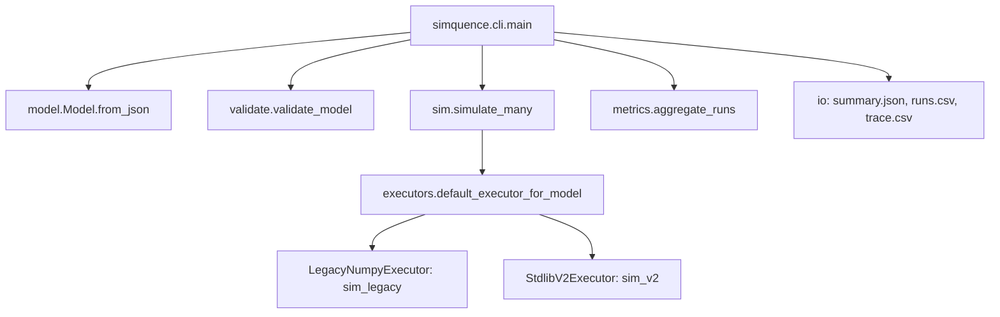
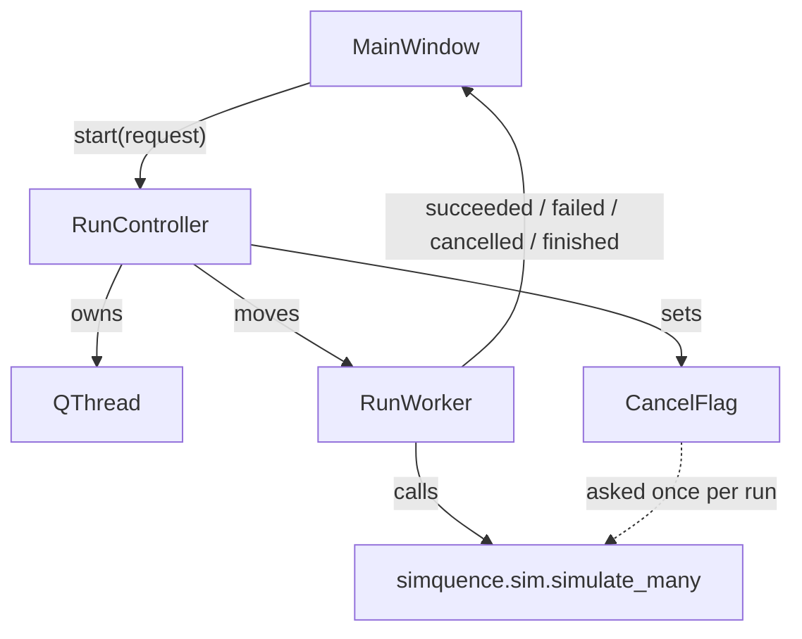

# Simquence Architecture

The architecture as implemented in this repository, in three parts:

1. **Core simulator** in [`simquence/`](simquence/__init__.py): model parsing and validation, executor dispatch, the engines, metrics and file outputs. Deterministic, standard library only, testable on its own.
2. **Desktop interface** in [`simquence_ui/`](simquence_ui/__init__.py): PySide6 widgets plus a threaded run controller, a thin client of the core.
3. **Delivery** at the repository root and in [`installer/`](installer/app.py): the scripts that build the Windows executable and setup program, the macOS disk image and the Flatpak.

## Invariants (enforced by tests)

1. **The core never imports Qt** and **never references `simquence_ui`**: source scans in [`test_ui_dependency_boundaries.py`](tests/test_ui_dependency_boundaries.py).
2. **The pure core modules touch no filesystem.** `model`, `types` and `validate` import only an exact allowlist and call no `open`, `__import__`, `exec` or `eval`; `io` does the loading: [`test_core_boundaries_and_packaging.py`](tests/test_core_boundaries_and_packaging.py).
3. **A model plus a seed gives the same result every time**: `test_simulation_is_deterministic_for_seed` in [`test_determinism.py`](tests/test_determinism.py).
4. **v1 execution is a frozen behavioural oracle**, pinned by a golden snapshot: `test_v1_outputs_are_stable_golden_snapshot` in the same file.
5. **A delay is visible and attributable**: it appears as a node in the trace and on the critical path ([`test_v2_delays.py`](tests/test_v2_delays.py)).
6. **A cancelled run set is never aggregated.** Stopping raises rather than returning fewer runs ([`test_cancellation.py`](tests/test_cancellation.py)).
7. **Every shipped example validates.** The examples are discovered from disk, so adding one opts it in ([`test_validation.py`](tests/test_validation.py)).
8. **Every reported version comes from `VERSION`** ([`test_version_single_source.py`](tests/test_version_single_source.py)).
9. **The wheel contains the headless core alone** ([`test_core_boundaries_and_packaging.py`](tests/test_core_boundaries_and_packaging.py)).
10. **No file exceeds 400 lines, nor sits within 5% of the cap**, tests included; the delivery scripts are exempt by name at the root and a companion test fails if an exempt name stops existing ([`test_codebase_size_limits.py`](tests/test_codebase_size_limits.py)).
11. **100% line coverage**, configured in `pyproject.toml` so a bare `python -m pytest` enforces it; the measured set is scoped by `.coveragerc`. black and flake8 are the exception to this heading: no test runs them.

## Component map

### Core (`simquence/`)

| Concern | Where |
|---|---|
| CLI: `python -m simquence` or the `simquence` script | [`cli`](simquence/cli.py) |
| Reading a model (duplicate keys refused), parsing, validation | [`io.read_model_json`](simquence/io.py), [`model`](simquence/model.py), [`validate`](simquence/validate.py) |
| Simulation facade | [`sim.simulate_many`](simquence/sim.py) |
| Executor seam: `RunExecutor` protocol and `default_executor_for_model` | [`executors`](simquence/executors.py) |
| Engines: v1 NumPy (frozen), v2 standard library (delayed wiring) | [`sim_legacy`](simquence/sim_legacy.py), [`sim_v2`](simquence/sim_v2.py) |
| Cancellation protocol and refusal | [`cancellation`](simquence/cancellation.py) |
| Aggregation, v2 task metadata, writers | [`metrics`](simquence/metrics.py), [`io`](simquence/io.py) |

### Interface (`simquence_ui/`)

| Concern | Where |
|---|---|
| Entry: `python -m simquence_ui`; `runner.py` is what the frozen build starts at | [`__main__`](simquence_ui/__main__.py), [`app`](simquence_ui/app.py) |
| Main window and its parts | [`main_window`](simquence_ui/main_window.py) and the `main_window_*` modules (actions, panels, file IO, menus, run, editing, dock switching, top bar) |
| Toolbar buttons, their pictures and their sizes | [`top_bar_buttons`](simquence_ui/top_bar_buttons.py), [`main_window_top_bar`](simquence_ui/main_window_top_bar.py), [`toolbar_metrics`](simquence_ui/toolbar_metrics.py) |
| Threaded run lifecycle | [`run_controller`](simquence_ui/run_controller.py) |
| Theme: tokens, one stylesheet template, the toggle, popup and table hardening | [`theme_tokens`](simquence_ui/theme_tokens.py), [`theme_stylesheet`](simquence_ui/theme_stylesheet.py), [`theme`](simquence_ui/theme.py), [`theme_toggle`](simquence_ui/theme_toggle.py), [`qt_style_helpers`](simquence_ui/qt_style_helpers.py) |
| Keyboard ring | [`focus_cycle`](simquence_ui/focus_cycle.py) and the `focus_cycle_*` modules |
| Dialogs: first-stop base, reading panes, About, licences, Guide, How to Read, auto-scroll | [`first_stop_dialog`](simquence_ui/first_stop_dialog.py), [`pane_focus`](simquence_ui/pane_focus.py), [`about_dialog`](simquence_ui/about_dialog.py), [`guide_text`](simquence_ui/guide_text.py), [`auto_scroller`](simquence_ui/auto_scroller.py) |
| Distributions (inspection, no resimulation) | [`distributions_dock`](simquence_ui/distributions_dock.py), [`distributions_agg`](simquence_ui/distributions_agg.py), [`critical_path_frequency_widget`](simquence_ui/critical_path_frequency_widget.py) |
| Model Composer, a modal two-pane dialog | [`model_composer_dialog`](simquence_ui/model_composer_dialog.py), [`model_composer_tree`](simquence_ui/model_composer_tree.py) and the per-part editors |
| Bundled data: one search, used for assets and examples | [`packaged_dir`](simquence_ui/packaged_dir.py), [`icon_resolver`](simquence_ui/icon_resolver.py), [`example_models`](simquence_ui/example_models.py) |
| Update check | [`update_core`](simquence_ui/update_core.py), [`update_github`](simquence_ui/update_github.py), [`update_settings`](simquence_ui/update_settings.py), [`update_check`](simquence_ui/update_check.py) |
| One instance, the Windows taskbar identity, the donate link | [`single_instance`](simquence_ui/single_instance.py), [`windows_identity`](simquence_ui/windows_identity.py), [`donate_button`](simquence_ui/donate_button.py) through [`links`](simquence_ui/links.py) |

### CLI call flow

### Interface threading

## The core

### Seams

- **Executors.** The facade asks `default_executor_for_model` for an engine: version 1 goes to `LegacyNumpyExecutor`, version 2 and above to `StdlibV2Executor`. A new engine implements `RunExecutor` and is selected there. It must keep event-queue semantics, may batch independent runs and must honour cancellation at the run boundary.
- **Cancellation.** The core is asked to stop through `CancellationSignal`, a protocol with one method, `is_cancelled()`. The interface passes a thread-safe flag; a test passes a counter. Neither is visible to the simulator.

### Model schema

- **Version.** `schema_version` (preferred), with `version` and `model_version` accepted as aliases. It must be an integer (`2.9` used to be truncated to 2 and run). Validation accepts only 1 and 2.
- **Contexts** have a `concurrency` of at least 1 and a `policy` locked to `fifo`. **Events** may carry `tags`; `"ui"` drives the first and last UI event times. **Tasks** have a `context`, a `duration_ms`, an `emit` list plus, in v2, an optional `meta` that is surfaced in the summary and never affects scheduling.
- **Distributions:** `fixed` (`value`), `normal` (`mean`, `std`, optional `min` floor defaulting to 0, so every draw below it is raised to it) and `lognormal` (`mu`, `sigma`). Every parameter must be finite: Python's JSON reader accepts `NaN`, which passes every `< 0` check; a NaN duration once hung the v1 engine forever. A lognormal `mu` above the log of the largest float is refused. Both engines sample lognormal by `mu` and `sigma`; there is no mean-based conversion.
- **Names** may not contain `>`, because critical paths are task names joined with `>` and a name containing it would merge two chains into one count.
- **Loading.** Every reader (the CLI, the run worker, Open and the editor) goes through `io.read_model_json`, which refuses a key repeated in one object; plain `json.loads` keeps the last, so a copied task that was not renamed used to replace the first silently. The CLI reports an unreadable or invalid model on stderr and exits with status 2.

### Wiring and delays

The JSON has one `wiring` object (event to listeners). A listener is `"task"`, `{"task": "task"}` or `{"task": "task", "delay_ms": <number or distribution>}`; a bare number becomes `fixed`. Parsing yields both the flat v1 map and the v2 edges.

`delay_ms` is version 2 only. The v1 engine walks the flat map, which carries no delay, so validation refuses a v1 model that declares one rather than letting it run as though the delay were not there.

In v2, an event at `t` on an edge with a delay creates a synthetic task `delay(event->task)` from `t` to `t + sampled delay` on the uncapped context `__delay__`, parented to the emitting instance; on completion it enqueues the target (`sim_v2.schedule_delay`). A delay is a node precisely so it can be blamed: in `examples/checkout.json` a 150 ms debounce is the critical path in most runs.

### Cancellation

The simulator is CPU-bound and cannot be interrupted safely from outside, so it is asked once per RUN. Each run seeds its own generator from its index, so stopping between runs cannot leave one half drawn; the worst wait before a stop is one run. Stopping raises `RunCancelled` with the completed count instead of returning a shorter set, because percentiles over half the runs look exactly like real ones. The interface reports that count. On shutdown the controller waits for the worker thread to finish.

### Outputs

`TaskInstance` rows carry two causality fields: `parent_task_instance_id` (who caused me to be enqueued) and `capacity_parent_instance_id` (who last held the slot I ran on). The CLI writes `summary.json`, `runs.csv` and an optional `trace.csv`. The summary counts requested, successful and failed runs, takes percentiles over the successful ones and lists the ten most frequent critical paths; task metadata is added for v2 only.

### Examples

`examples/` holds the models the tests validate, the docs point at and the Examples menu opens. All three discover the folder rather than list it; the menu label comes from the file name. All three delivery paths stage it beside the application.

| Example | Shows |
|---|---|
| `interactive.json` | The smallest useful v1 model: one click, one background fetch, one render. |
| `contention.json` | A concurrency limit, so queue wait becomes visible. |
| `checkout.json` | A v2 checkout: four parallel branches, a serialised database and a fixed debounce that owns the median. |

## The interface

### Run lifecycle

Run builds a `RunRequest`; the controller moves a `RunWorker` onto a `QThread` with the cancel flag. The worker reads, validates, simulates, aggregates (adding v2 metadata) and emits signals back to the UI thread. `succeeded` arrives BEFORE `finished`, so anything that depends on "the run is over" belongs on `finished`.

### Update check

The app asks `https://api.github.com/repos/oernster/Simquence/releases/latest` about 3 seconds after the window shows, every 24 hours while running and on demand from Help > Check for Updates. That endpoint returns only published, non-draft, non-prerelease releases. The request is anonymous, times out after 5 seconds and fails silently on the automatic paths.

- Pure logic (version comparison, platform asset choice, the check) sits behind a `ReleaseSource` protocol in `update_core`; `update_github` is the urllib adapter with the opener injected, so tests never touch the network.
- The HTTP call runs on a `threading.Thread`; the answer returns through a Signal to `UpdateCheckController` on the UI thread. The worker drops an answer whose controller is gone and re-raises any other emit failure.
- The prompt opens with `open()`, never `exec()` (no nested event loops anywhere). Download opens the platform's asset, else the release page; Skip This Version is kept in `~/.simquence/settings.json` and never prompts again automatically; the manual check ignores the skip.
- `app` builds the service and calls `install_update_check`; the window contributes only the Help action.

### Keyboard navigation

One explicit focus ring rather than natural Tab order.

- `Tab` and `Right` step forward, `Shift+Tab` and `Left` back, wrapping at both ends; the arrows are handled first so the menu bar or a list cannot swallow them. A disabled or hidden control is skipped and shows no ring colour.
- Ring order: menu titles, then the body, then the docks (collected explicitly, since docks are siblings of `centralWidget()`). Dialogs own their focus.
- **A container that overlays states its own order.** The toolbar centres the distributions toggle on the whole bar by sharing one grid cell with the button row, so layout order reached it last, after the far-right theme toggle. `NavBand.ring_stops()` declares the left-to-right order and `focus_cycle_widgets.declared_ring_stops()` prefers it. Tests assert the order against where controls are DRAWN and fail if a control on the band is missing from the declaration.
- The main window starts neutral. Dialogs open on their first usable control ([`first_stop_dialog`](simquence_ui/first_stop_dialog.py)), passing over reading panes, so About, the Guide, How to Read and the licences open on OK.
- **A pane is never a stop; a reading pane is one only while it overflows.** [`pane_focus.follow_overflow()`](simquence_ui/pane_focus.py) gives `TabFocus` while there is somewhere to scroll and `NoFocus` otherwise, never `StrongFocus` (a click would focus the page). The composer's scrolling pages are `NoFocus` outright (`as_pane()`).
- **Examples is a top-level menu** because the ring claims Left and Right, which Qt uses to open a submenu.
- Menus are built by `main_window_menus.add_menu()` with an explicit parent. `menuBar().addMenu(title)` looks equivalent but its menu dies when the Python wrapper of its action is collected, which the ring's rebuild of that wrapper list triggers.

### Theme

One stylesheet template from one token set per theme. The ring model holds by construction: no ring at rest, green while an enabled control is hovered or focused, a permanent red ring while disabled. It is for CONTROLS: a text view keeps its resting border in every state and a structural test fails any rule that rings a text view, item view or container. `accent` (banana yellow, one value in both themes) carries meaning and never draws a ring; anything painted on it takes `accent_text`, a near-black. A picture on a checked button is the exception: it keeps its colours and the fill alone says "on". Flattening the distributions chart to that ink was measured and rejected; it read as a dark mound.

- **Anything that floats gets its own surface.** Menus, tooltips and combo popups use `elevated`, `elevated_border` and `elevated_hover`. Without them a dark-theme menu measured at zero luminance difference from the window; [`test_ui_menu_contrast.py`](tests/test_ui_menu_contrast.py) asserts against rendered pixels. A combo popup is palette-driven (a CSS background on its view brings back invisible text), so it reads `elevated` from the `ToolTipBase` role at the moment it opens.
- **One rule decides how tall an input stands.** `QDoubleSpinBox` is a sibling of `QSpinBox` rather than a subclass; `QLineEdit` was unnamed. So three inputs doing one job stood at 51, 19 and 22 px. The rule names `QAbstractSpinBox` and `QLineEdit`. Nothing may overrule it: an explicit minimum height and a `Maximum` vertical policy were both letting layouts squeeze controls below it. [`test_ui_input_metrics.py`](tests/test_ui_input_metrics.py) asserts no input is drawn smaller than it asks for, measured after layout settles.
- **Scrolling past a control never changes it.** [`wheel_guard`](simquence_ui/wheel_guard.py), installed once on the application, denies the wheel to an unfocused input and forwards it to the nearest ancestor that can scroll on that axis (`enclosing_scroll_area`); `deny_wheel_focus` removes Qt's default `WheelFocus`, which made the wheel focus a control on the way past.
- **A table is as tall as what it holds.** `size_table_to_rows` fixes the height to the rows (capped at `MAX_VISIBLE_TABLE_ROWS`), `stretch_table_columns` gives the name column the slack and `fit_rows_to_contents` lets a row be as tall as its tallest control. Heights are read with `_settled_row_height` at the end of each mutator, since Qt reports the old value until its header recalculates.

### The toolbar

- **Pictures, not emoji.** Every action wears a supplied picture from `assets/`, named in `icon_resolver`; an emoji is whatever font is installed. [`artwork_icon()`](simquence_ui/top_bar_buttons.py) trims each picture's transparent margin so all fill the same box, then draws disabled as grey and faded: a picture that kept its colour while disabled would read as half-available. A missing picture leaves the action's name as words.
- **The distributions toggle sits dead centre**, since that panel is the point of having run anything. Three stretches centred it in the space left over and landed it 134 px off centre at 1400 px; an overlay sharing one grid cell centres it exactly. Its height is fixed and its width natural, since fixing both clips the stylesheet's frame; a minimum width holds the centre if its picture is missing. Centring on the bar ignores the groups beside it, so when the pictures doubled a narrow window drew the toggle over Edit: `NavBand.minimumSizeHint()` now holds the bar at twice its wider side group plus the toggle, read from the controls' own sizes; a test asserts nothing overlaps at a window far narrower than that.
- **Sizes live in [`toolbar_metrics`](simquence_ui/toolbar_metrics.py)**, which has no Qt: 48 px pictures, a 40 px donate mark and 36 px emoji. The button height is the picture plus its ring and padding; the stylesheet reads the same constants, so the two cannot drift.
- **A panel button says whether the panel is up.** Distributions is a toggle whose checked state follows the dock's `visibilityChanged`, never the click, so it tells the truth when the dock closes by its own cross. A refused click puts the button back.
- Compose and Edit appear on the bar and under the Model menu, wired to the same callable; only Edit changes availability, gated by the same `availability()` call as everything else.
- The donate button sits beside the theme toggle and hands `DONATE_URL` to the desktop through the `links` seam; the app never fetches the page. A desktop that refuses gets an information box naming the address.

### The composer

A modal two-pane dialog. As a dock down the side, with `examples/checkout.json` loaded, it asked for 4,822 px of height in a viewport of about 880. [`ComposerTree`](simquence_ui/model_composer_tree.py) lists the parts of a model (only Tasks has children) and the right pane shows the one selected. Measured the same way afterwards, every part fits without scrolling (System 220 px, Contexts 328, Wiring 368, one task 453, in a 753 px pane).

- The tree is relabelled rather than rebuilt while the task count is unchanged, since rebuilding on each keystroke would steal the field being typed into. Task rows come from `card_labels()` so positions match the cards even while a name is half typed.
- It is shown with `show()`, never `exec()`; both are modal because the dialog says so, while `exec` also starts a nested event loop. The export prompt survived the move from a dock; the compose button's checked state did not.
- **Composing and editing are one surface.** `model_composer_load.load_raw_model()` fills the editors in a load-bearing order: contexts first (a task can only pick a known context), then the version (it decides whether a card shows its category), then tasks, then wiring. Reading accepts every spelling the format allows (`read_schema_version`, `wiring_edges_from_raw`), so any model the engine runs, the editor opens. An open editor follows the next model opened (`refresh_open_editor`) unless it holds work typed from scratch.

### Guidance

The Guide says which button to press and why one setting rather than another; How to Read says what the output means. They answer questions asked at different moments, so they are two documents. The text lives in [`guide_text`](simquence_ui/guide_text.py) and `about_text` apart from the widgets. It is HTML on a `QTextBrowser` because [`auto_scroller`](simquence_ui/auto_scroller.py) moves in pixels: it descends slowly, holds, rewinds fast and repeats, suspending the moment the reader touches it. `QPlainTextEdit` scrolls in lines (measured over 300 lines: 293 units against 4,348), so the same drift there jumps a line at a time. The run output does not self-scroll. The installer carries a standalone copy, since it cannot import `simquence_ui`.

### One instance and the taskbar

[`single_instance`](simquence_ui/single_instance.py) is a local socket rather than a lock: the first copy listens, a second connects, asks it to come forward and exits. A bare lock would leave the second launch with nothing; a stale socket name simply refuses connections, where a stale lock file has to be aged. [`windows_identity`](simquence_ui/windows_identity.py) claims the same Application User Model ID the installer puts on its shortcut, so the pinned icon and the window are one taskbar item; a test asserts the two constants match.

### Pointing at what to do next

When a model loads, [`attention_flash`](simquence_ui/attention_flash.py) flashes Run's border twice and stops; a pulse until obeyed would be a nag. It uses the ring's green and never flashes a disabled control, so it cannot argue with the red ring.

## Delivery

### Package

The core's runtime dependencies are empty; PySide6 comes from `requirements.txt` for the interface; NumPy is the lazily imported `legacy` extra, whose absence produces an error naming it. The find rules include `simquence*`, which also globs `simquence_ui`, so the interface is excluded by name. The console script exposes the CLI only.

### Desktop builds

| Script | Produces |
|---|---|
| `buildexe.py` | The Nuitka standalone bundle in `installer/payload/`, smoke tested by starting it headless and failing the build if it exits. |
| `buildinstaller.py` | `dist-installer/SimquenceSetup.exe`: the payload zipped, wrapped in the setup program as a Nuitka onefile. |
| `builddmg.py` | The macOS disk image: PyInstaller, stray `*.o` stripped, signed, notarised and stapled. |
| `build_flatpak.sh`, `clean_flatpak.sh` | The Flatpak, its manifest generated, wheels pre-downloaded and installed offline; `--share=network` for the update check. |
| `generate_icons.py` | Every icon from `assets/application-icon.png`, plus the site logo and the donate mark. |
| `stamp_version.py` | The version tokens in the site under `docs/`. |

Every path stages the icons, `examples/` and the licence texts beside the application; the Flatpak also exports `SIMQUENCE_ASSETS_DIR` and `SIMQUENCE_EXAMPLES_DIR`, the same overrides the tests use.

Load-bearing findings, recorded so they are not rediscovered:

- **`runner.py` must not rewrite `sys.argv[0]`.** Nuitka's PySide6 plugin reads it to extract the compiled-in icon; pointed at a module name it finds no file and the frozen app dies before its first window, silently.
- **A Nuitka onefile strips loose executables out of an `--include-data-dir`**, so the payload is zipped and extracted at install time.
- **The Flatpak builds Kerberos for a library it never calls.** `libQt6Network` links `libgssapi_krb5.so.2`, which the runtime lacks; the single-instance guard imports `QtNetwork`. Without it the app failed only in the Flatpak, only at start-up. A `krb5` module (1.22 or newer, since earlier ones fail the SDK's compiler) is pinned by URL and SHA-256. The prune keep list therefore names `QtSvg` and `QtNetwork` beside the core three.

### The setup program

[`installer/`](installer/app.py) is an application, held to the size cap: per user, no administrator rights, extracting under `%LOCALAPPDATA%`, writing the HKCU uninstall key and offering Desktop and Start Menu shortcuts. Decisions live in `installer_logic` (no Qt, no registry) and are tested; effects live in `installer_ops`. Coverage omits `installer/`, since only a real filesystem and registry prove it.

**An install under the old name is cleared only when asked.** Simquence was LatencyLab, a different identity everywhere, so an update would otherwise stand beside the old install. After installing, setup reads what the machine holds under the old name into a frozen record and [`installer_legacy`](installer/installer_legacy.py) decides what may go: the folder only if it is named `LatencyLab` and holds `LatencyLab.exe`; a shortcut only if its target lies inside that folder (compared case-insensitively, a `LatencyLab2` sibling excluded); the Apps entry only with the folder, else once its folder is gone. Everything else is reported and left. A dialog lists all of it; removal runs only on the user's say, after checking LatencyLab is not running, folder first so a failure leaves the Apps entry to finish from. A failure stops the launch so the message stays on screen. [`test_installer_legacy.py`](tests/test_installer_legacy.py) holds every rule.

### Version

`VERSION` is the only real version string. [`simquence.version.read_version()`](simquence/version.py) reads it (falling back to `0.0.0-dev`); the interface re-exports it and `pyproject.toml` declares it dynamic. The site carries `<!--VERSION-->x.y.z<!--/VERSION-->` tokens that `stamp_version.py` rewrites idempotently under `docs/` only; it also hashes each local stylesheet and script link (`styles.css?v=<hash>`) so a fresh page never pairs with a stale cached stylesheet.

### Licences

The core (and so everything published) is GPL-3.0, the root `LICENSE`, shown under Help > Main Licence; `pyproject.toml` declares `GPL-3.0-only`. The front end is LGPL-3.0, `simquence_ui/LGPL3.txt`, shown under Help > UI Licence. The setup program carries its own `INSTALLER_LICENSE`.

### Icons

- `assets/application-icon.png` is the one master. `generate_icons.py` derives the PNG sizes, the multi-size `.ico` (each frame rendered from the master, since Pillow's own downscales are visibly worse at 16 and 24 px), the `.icns`, the Flatpak hicolor set and the site logo `docs/assets/simquence.png`. Nothing paints an icon at runtime; `icon_resolver` finds where the packaging put them.
- **macOS icons are opaque; the rest are transparent.** The Dock, Finder and the mounted image composite straight onto the desktop, where a transparent mark floats on pale grey. The macOS outputs sit on a black tile inset to Apple's grid (824 of 1024 points, 185.4 point radius, the corner mask supersampled because Pillow does not antialias it) under a separate `simquence_icon_mac` stem; `app_icon_names` makes the Dock icon macOS-only while the in-app badge stays transparent.
- **The donate mark has its own master**, `donate.png` at the root, cropped and scaled by height to four times the toolbar's `GLYPH_PX`. The site's `docs/donate.png` is the small mark every project site shares byte for byte, so it is copied rather than derived.
- The toolbar's action pictures (`assets/simquence_*.png` other than the icon set) are supplied finished and read as they are.

---

See also [README.md](README.md), [TESTING.md](TESTING.md) and [DEVELOPMENT.md](DEVELOPMENT.md).
